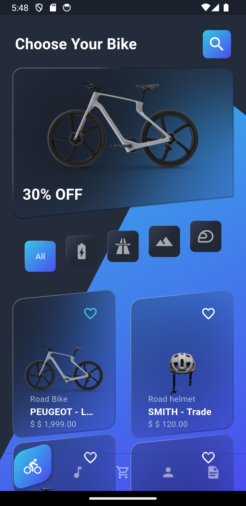
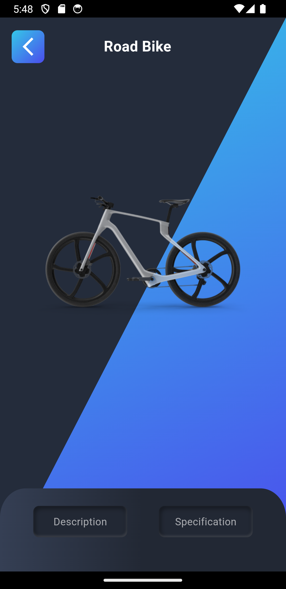
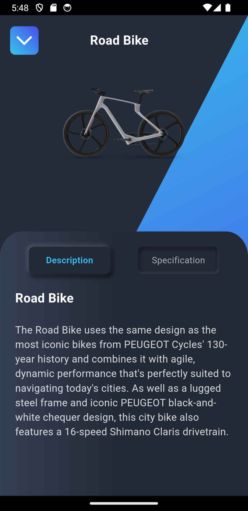

# Bike Shop UI

A simple and visually appealing Bike Shop UI built with Flutter.

## Features

- Displays a list of bike products with dynamic cards.
- Features a visually engaging category list.
- Includes a product details screen with smooth animations.

## Video

|  |
|----------------------------------------|

## Screenshots

|  |  |  |
|-------------------------------------|--------------------------------------------------|--------------------------------------------------|

## Installation

1. Clone this repository: `git clone https://github.com/yourusername/bike-shop-ui.git`
2. Navigate to the project directory: `cd bike-shop-ui`
3. Install dependencies: `flutter pub get`
4. Run the app: `flutter run`

## Figma Design

This UI was inspired by a Figma design by [Sourasith] ([link to design](https://www.figma.com/community/file/1149336740234053658)).
